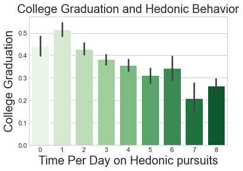
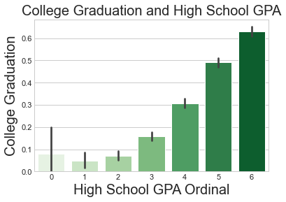

## Machine Learning Assisted College Advising
   Every year millions of high school students enroll in college.  About 40% of these students will not graduate.  Dropping out of college is a demoralizing and expensive way to start adulthood.  The average college dropout incurs about 13,000 dollars in debt.  About 50% of these students will default on this debt.  These financial considerations are beside the difficult to quantify psychological effects that can come from the subtle indoctrination that a university credential is a prerequisite for success, and the potentially life altering knowledge that they have failed to achieve this prerequisite.  The purpose of this study is to develop a data based exploration of college success to reveal the core traits of a successful college student, and build a machine learning model predicting college graduation.  These predictions must only use data that can be known about the student at the time of high school graduation.  This analysis reveals three key features of a successful college student.  Successful college students have standardized test scores, most importantly math scores, that are on average about one standard deviation above their peers, they have strong high school grade point averages, and have confidence in their ability to actualize academically.  Currently a guidance counselor has to rely on intuition that might be muddled by myriad sources of well intentioned bias.  A machine learning model can take a student's data and provide a more definitive answer on how well prepared a student is for college.  By using the results of the model a guidance counselor can, with increased precision, advise a student on where they stand, and then use this knowledge with a more holistic understanding of a student's situation to advise a path forward that is grounded in data.  

###  The Data
   This analysis uses the Educational Longitudinal Study of 2002.  The Educational Longitudinal Study of 2002 followed about 16000 people over ten year period starting in their sophomore year of high school through three follow up data collections over the next decade of the individual's life.  The first follow up is in the student's senior year of high school, a second follow up two years after high school graduation, and the third follow up in 2012, or at about the age 26.   The entire dataset has about 5000 features made up of information collected from questionnaires, academic performance data supplied by the school, and other means of collection.  Much of this data is restricted in the public release version of the study.  From the publicly available data I have chosen 31 features.  These features have information on things like standardized test scores, screen time, home life, discipline, and extracurricular activities. For a more complete breakdown of the features used in my analysis see the markdown file titled [features.md](https://github.com/eonslemp/ML_assisted_college_advising/blob/master/features.md) in this repository, or to access the original study click on this link to the online [codebook](https://nces.ed.gov/OnlineCodebook/Session/Codebook/464e26ac-050e-4cc2-9347-1297cf285b4f).   My analysis takes data from the base year and the first follow up.  These data correspond to the student's sophomore and senior year of high school respectively and provide a snapshot of the student at the point just before college enrollment. The college outcome data comes from the third follow up.  Understanding and predicting these outcomes is the objective of this study.
   
### Methods
   This analysis uses some basic statistics, visual explorations, and classification algorithms to gain insight into successful college students and predict college graduation.  Algorithms used in the modeling are random forest, logistic regression, xgboost, gaussian naive bayes, and KNN.  The purpose of the modeling is to correctly identify the green in the following scatterplot: 
 

### Results
   Using fewer features provides insight into what is most important for college success.  A gaussian naive bayes model with a three feature dataset was able predict with an almost .75  recall score and about .65 F1 score.  This dataset's features were mathematical facility, high school GPA, and educational confidence.  The 'mathematical facility' feature is the product of the student's math standardized test score and an ordinal value corresponding to the highest math class completed in high school.  'educational confidence' is a feature in the original study, and is an ordinal value corresponding to the highest academic achievement the student expects to complete.  High school GPA, as reported in the public release version of the study is an integer value between 1 and 6 that reflects an approximation of the decimal value of grade point average.  This quality is reflected in the horizontal stratification in the above scatterplot. Also note that the 3 features in the modeling dataset are not the same 3 features represented by the axes in the above scatterplot.  The modeling set has two features that are ordinal values and when visualized are difficult to interpret.  The above visualized three features yield a more interpretable way to understand a complex phenomenon.  Below is a scatterplot of the three feature dataset used in the modeling. Notice the cluster of green that appears at points 6, 7, and 8 along the 'Educational Confidence' axis.  These values corespond to 'complete a bachelors degree', 'complete a masters degree', and 'complete a PhD' respectively. Point '9'  was corresponds to the 'unsure' option in the orginal survey and, consequently few green points.   
   

 
   This study reveals what may seem obvious. Successful college students have verbal and mathematical standardized test scores that are, on average, about one standard deviation above their peers; however, it is important to note that non-college graduates populate the full range of ability as measured by the standardized testing.
 
 

Specifically, mathematical reasoning ability gives the student an advantage in both college performance and in the economy. 

 

Successful college students are disciplined, in that they control hedonic pursuits like video game/movies/tv etc ... and invest time outside of class on homework.  

'educational confidence' was a feature that came out of the modeling, that I had included reluctantly in the original feature selection. I expected it to be of minor importance for this task.  It is defined in the study as the highest academic achievement the student expects to complete and is self reported.  Feature importance functions twice identified this feature as one of the most useful features for correct classification. This feautre is now the most interesting data in this analysis to me, as one can imagine that packed within it, like a Russian nesting doll, are millions of pieces of information that the student has been logging since childhood.  Data that is then filtered through the subjective prism of the student's self assessment.  This data informs a sense of academic self efficacy that emerges in the form of an ordinal value in this study.  Whether the relationship between college success is causative or correlative cannot be determined here, but intuition leads me to think that its nature is correlation.  Meaning that it would be unlikely that some kind of intervention designed to condition high academic goals, outside of commensurate academic achievement, will be effective; however, this conclusion cannot be properly supported from this study.  

Successful college completers also tended to have fewer risk factors present in their home environment.  Risk factors, as defined by the study, are things like household income below the poverty level, frequent school changes, broken family structure, or low educational achievement on the part of the parents.   

Lastly, this exploration identified high school grade point average as being useful for correct classification. 

Model performance metrics improved slightly with tuning.  My baseline model was a random forest trained on a data set that had, including dummy variables, 67 features.  This model yielded an F1 score of .6021.  An extensive modeling process yielded my best model, which is a gaussian naive bayes trained on a data set that had only 3 features.  This model yielded an F1 score of 0.6511 with a recall score of .7405.   During the modeling process I worked with the random forest, logistic regression, xgboost, gaussian naive bayes, and KNN algorithms.  F1 score tended to improve from high .50's to low to mid .60's with tuning and feature optimization for most models.  The Best F1 score came from gaussian naive bayes at about .65.  I achieved best precision metric with logistic regression at .6204, and best recall with gaussian naive bayes at .7405 of college completers correctly classified.  
The following curves are precision/ recall trade off curves for the best performing models:

College dropout rate is about 40%, or in other terms, colleges correctly classify about 60% of applicants that were admitted and did attend with their admissions process.  While the classification task performed in this analysis is similar to, it is not precisely comparable to the classification done by colleges.  The modeling in my study correctly classifies about 75% of students that would go on to graduate college, but this work is done on a dataset that contains admitted students that went to college and graduated, that went to college and dropped out, and students that did not go to a 4yr college.   The students that did not go to college fall into categories as well.  Some of those were denied admission.  A fraction of those denied admission would have graduated, and fraction would have dropped out.  Some applied, and were admitted, but did not attend.  Some of those that were admitted, but did not attend might have graduated, and some fraction would have dropped out. Some of those that did not apply would have been admitted, and a certain fraction of those would have graduated, and a certain fraction would have dropped out.  I can speculate on what those fractions might have been, but such speculation would bring no useful insight.   The combinatoric potential of these metaphysics quickly becomes staggering, and this nuance is lost in the way the data is structured in the original data and in the analysis conducted here.  By including all of these data and analyzing in this way I have introduced what would appear to be a methodological flaw, and perhaps it is. I will argue in the conclusions section this potential flaw is a feature and not bug.  

### Conclusions

This study reveals what may seem obvious.  Successful college students have verbal and mathematical standardized test scores that are, on average 1 standard deviation or more above their peers. Specifically, mathematical reasoning ability gives the student a particular advantage in completing a college degree... and ultimately in the economy.   Successful college students are disciplined, in that they limit hedonic pursuits, and invest significant time outside of class on homework.  They tend to come from a home environment that is low in risk factors like broken family structure, frequent changes in school, or poverty and has reading material readily available. Finally, they tend to have a track record of high academic achievement as evidenced by their high school grade point average.  This insight is not paradigm shifting by itself, but does represent a useful qualitative understanding what tends to support success in college.  What about the modeling?  What is an actual use case of the modeling results?  Here is the confusion matrix of my best model:

205 students were incorrectly classified as likely drop outs and 422 student were incorrectly classified as likely graduates. What about that more nuanced unpacking of the dataset in the results section?  What about those bright and capable students that would have been advised to not attend college if this modeling were strictly followed, but a lack of data obtusely categorizes them as not advised to attend.   Remember that hidden in these boxes are the several considerations mentioned in last paragraph of the results section, and that I promised to argue that what may appear to be methodological flaw may actually be a feature.  I argue this point thusly...A popular back of the envelope calculation of what it takes to be successful in an endeavor looks something like this: 
Outcome  = (Motivation x Ability) + Previous Experience  
I would ask the reader for charity with regard to the empirical soundness of this expression.++ As an analyst and as an agent with 42 years experience in the universe I believe that this idea is directionally correct.  If we accept it as an approximation and allow it as an assumption we can proceed as follows:  Negative feedback will tend to dissuade individuals that might be borderline but, lack the required motivation to compensate for suboptimal metrics.  Individuals that receive this feedback and set their jaw and say: 'I understand what the model is telling me, but I want this', such feedback will have no effect.  Perhaps they have their heart set on a vocation that requires a degree.  It is the determination to persist in the face of this feedback that will allow the marginal student to self select, and thus begin to exercise the qualities that will be required for a student with his/her qualifications to succeed.  

I admit that the analysis in it's current form cannot fully support some claims I am about to make.  My intuition tells me that college enrollments are too high when considered in light of the actual return on investment that many students can hope to get from the aspired credential.  Interests orthogoanal to the students might alter the admission process in ways that do not actually benefit some students.

To what degree colleges are not simply selecting for the cognitive elite is not clear. This cognitive elite may have higher earnings outcomes that are caused by their intelligence, and not strictly as a result of a college credential. Highly capable students may be able to find their way in the economy successfully without a college degree.  Conversely, lower functioning college students may not have their value in the economy enhanced to the point of benefit.  In other words, it may be that the opportunity cost of college is not positive for many students that graduate successfully, and that the student's for whom the ROI of this adventure might not be positive are most likely to be concentrated in those 'graduatable' marginal students that are advised not to enroll, or 'false negatives' or those droppout-but-to attend 'false positives'.  An exploration of these groups coupled with an exploration of return-on-investment considerations is required to properly suport such a conclusion.  Perhaps a future iteration of this project will take a more definitive look at college and return on investment and what a student's metrics with positive college ROI would look like in high school. For now my intuition tells me that, based on the above considerations of motivation and ROI, that this approach is correct. I believe that the results of this modeling could be used with higher confidence than a recall score of .7405 would seem to suggest. 

A guidance counselor can use this analysis, and modeling together with a more holistic understanding of the student's situation to help guide the student to a more rational decision.  A student with robust financial support, but marginal qualifications may still find utility in college enrollment, as they will be protected from financial catastrophe in the event of dropout.   A student lacking some clearly defined vocational goal and excellent metrics as defined by the study, but in a more precarious financial situation may defer college admission until he achieves more clarity about the future.  A student that is highly motivated for a vocation that requires a college credential, like medicine or engineering, but borderline on or non-selected by the modeling, can be counseled about the risks involved and amount of commitment required to bring these aspirations to fruit.  College advising is an art and this study cannot take the art out this process, but it can provide useful feedback on the probability of success that is superior to the probability of success implied by an acceptance letter. With this knowledge and a holistic understanding of the student, these findings can enhance the decision making process for guidance counselors and high school seniors.  This study is not designed to take the art out of this process, but enhance the state of the art by grounding an assessment of the situation in data.  

++  To support this point I would point out that the three traits:  ability, motivation, and previous experience are thematically congruent with high school' GPA', 'standardized testing', and 'effort'.  If the 'effort', as I have defined it, is taken as a reasonable measurable proxy for 'motivation', standardized testing as a measure of' ability', and high school GPA is interpreted as a measure reflective of education achieved to date or 'previous experience', then those three axes are coincident with the three elements in the expression and can serve as the core components of a model of what it might take for a successful college outcome. Maybe the arithmatic works out precisely this way or maybe it doesn not. Either way those three quantities seem to nicely concentrate the green in the corner of the graph. 

### Next Steps
**Dashboard deployment** - Build an interface that can take data and return a classification decision 
**Deeper Statistical Exploration** - A more sophisticated exploratory statistical analysis might yield more insight into some of the peculiarities noted in the EDA.  
**Study 'false negatives' and 'false positives'** - A detailed look at students that were classified as 'false negative' or 'false positive' quadrants of the confusion matrix by the model.
**ROI** - Build out a further model of college return-on-investment.  
**Neural Network** - Implement a neural network. 
**Multi-class parsing** - With improved performance metrics from a deep learning application it may be possible to identify students best suited to four year college, community college, and trade school.

### More info
For a more detailed look at this analysis see the [repository](https://github.com/eonslemp/ML_assisted-college_advising) or contact Eon Slemp at eonslemp@gmail.com 
The data used is from the Educational Longitudinal Study of 2002:  https://nces.ed.gov/OnlineCodebook/Session/Codebook/464e26ac-050e-4cc2-9347-1297cf285b4f