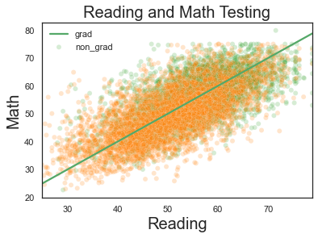
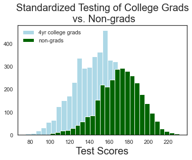
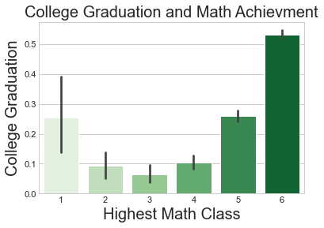
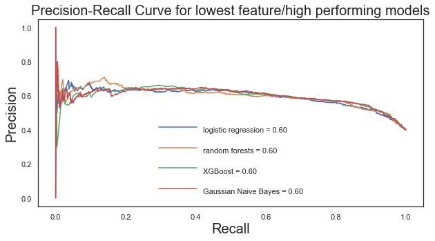

## Machine Learning Assisted College Advising
Every year millions of high school students enroll in college.  About a third of these students will not graduate.  Droping out of college is a demoralizing and expensive way to start adulthood.  The average college dropout incurs about 13,000 dolalrs in debt.  Almost 50% of these students will default on this debt.  These financial considerations are independent of the unmeasurable psychological damage that can come from the subtle indoctrination that a university credential is a prerequisite for success and the potentially life-sabotaging knowledge that they have failed to achieve this prerequisite.  
The objective of this study is to build a model predicting the likelihood of college graduation for a student in high school using only data that can be known about the student at the time of high school graduation.

###  The Data
 This project uses the Educational Longitudinal Study of 2002.  The Educational Longitudinal Study of 2002 followed about 16000 people over ten year period starting in their sophmore year in high school through three follow up data collections over the next decade of the individuals' life.  The first follow up is in the student's senior year of high school, a second follow up two years after high school graduation and the third follow in 2012, or at about the age 26.   The entire dataset has about 5000 features made up of information collected from questionaires, academic performance data supplied by the school, and other means of collection.  Much of this data is restricted in the public release version of the study.  From the publically available data I have chosen 31 features.  The features relate to things like academic ability, academic performance, home life, discipline, and extracurricular activities.  
 My analysis takes data from the base year and the first follow up in the students' senior year of high school.  These provide a snapshot of the student at the point just before college enrollment. The college outcome data comes from the third follow up.  This data is the target of the modelling and predicting these outcomes is the objective of this study. For a more complete breakdown of the data please see the readme titled 'features.md' in this repository.  
Link to the online [codebook](https://nces.ed.gov/OnlineCodebook/Session/Codebook/464e26ac-050e-4cc2-9347-1297cf285b4f). 
### Methods
 This project uses some basic statistics and visual explorations of the data to gain insight into college success. This study also uses machine learning modeling to predict college graduation.  Machine learning algorithms used in the modeling are Random Forest, Logistic Regression, XGBoost, Gaussian Naive Bayes, and KNN.  The modelling is trying to correctly identify the green in the following scatterplot: 
 

### Results
 Using models with fewer features provides insight into what is most important for correct classfiication of graduate/non-graduate and ultimately, what is most important for college graduation.  XGBoost with the most restriced data was able predict with almost 70% accuaracy score and about .60 f1 score.  This dataset's features were standardized testing, high school academic performance, home risk factors, highest math class completed, and time spent on entertainments.   This study reveals what may seem obvious. Succesfull college students have verbal and mathematical standardized test scores that are, on average, about 1 standard deviation above thier peers.  It is important to note that non-college graduates populate the full range of ability as measured by standardized teting.
 
 

Specifically, mathematical reasoning ability gives the student an advantage in both college graduation and prospects in the economy. 

 

Succesful college students are disciplined, in that they control hedonic pursuits and invest time outside of class on homework.  

They tend to come from a home environment that is low in risk factors like broken family structure, frequent changes in school, or poverty.  

Model performance metrics improved in the modeling process.  Accuracy score tended to improve from high 60%'s' to just over 70% with tuning.  The Best F1 score came from gaussian naive bayes at about 65%.  I achieved best precision metrics with random forest and best recall with recall with gaussian naive bayes at 81%.  
The following curves are precision/ recall tradoff curve for the best performing models:

College dropout rate is about 40%, or in other terms college implicitly correctly classify about 60% of applicants with thier admissions process.  While the classification task performed in this study is similiar to, it is not precisely comparable to the classification done by colleges.  The subset of data I have used includes community college and trade school students that likely do not apply to a four year college.  In this way my classification task is easier, as the models here have to parse individuals that a college would quickly deny admission to.  I chose this particular subset of the data to give the modeling the widest possible relevance to a randomly selected high school student.  
### Conclusions:  Fitting the Metric to the Decision Maker
 I believe that f1 score is the most usefull metric with regard to the modelling outcomes. F1 strikes a balance between recall and precision.  Recall minimizes students excluded from college thus maximizing dropout rates.  Conversely, using the precision metric would recommend the strictest controls on college admissions and thus minimize dropout rate; although, my analysis at this point cannot support some claims I am about to make, my intuition tells me that college enrollments are too high when considered in light of the actual return on investment that a student can hope to get from the aspired credential.  College aspirations are most likely influenced by an inflated assesment of the acutal value of the credential.  To what degree colleges credentials provding a measurable value gain and not simply signaling membership in the cognitive elite is not clear.  Highly capable students may be able to find thier way in the economy succesfully without a four year college degree.  It may be that the return on investment of college is not positive for many students that graduate. Precision, with its narrowing of the window for recommended college enrollment might be the best metric as it would set a higher bar for supporting an admission recomendation and allow students for whom the return on investment is not positive to bypass the opportunity cost of college.  To support this claim I have to do further analysis.  At this point I recommend F1 score as the performance metric of choice. 
There may be an arguement that precision, recall and F1 can each be useful to different decision makers.  From the student's perspective, precision might be the prefered metric.  Precision will offer the most protection for the students investment of opportunity cost of a possible university adventure.  Precision provides the student the most conservative assesment success and the most protection of his/her time and money.  
Guidance counselors might gravitate to F1 for advising purposes.  F1, considered in light of costs associated with college enrollment and likelihood of success can provide a more balanced look at a students prospects. F1 score strikes a balance between the exclusion of precision and the permissivity of recall. With detailed knowledge of a student, the guidance counselor can guide the student in considering the potential costs and benefits of college enrollment.  
A college admissions dean would likely prefer recall, as recall will favor the institution's business considerations by maximizing the pool of available customers. Maximizing recall will reduce the number of qualified students denied admission, but increase the number of students dropping out.   

### Next steps
**Dashboard deployemnt** - build an interface that can take data and return a probablity of college success  
**ROI** - Build out a further model of college return-on-investment. I am still working out how to do this. First thoughts are to subset the college graduate class and use the wage data to compare income to a non-college graduates with similiar data profile. Subtract the two and the use the 'time to graduation' data to estimate total cost of college. subtract this from the first caclulation and categorize negative values as negative or positive ROI. Then put the classifier to work predicting postive or negative ROI for that student based on just the high school data. 
**Neural Network** - Build a neural network for this classification task. 
**Multi-class** - With improved performance metrics from a deep learning application it may be possible to identify students best suited to four year college, community college, and trade school.

### More info
For a more detailed look at this analysis see the [repository](https://github.com/eonslemp/ML_assisted-college_advising) or contace Eon Slemp at eonslemp@gmail.com 
The data used is from the Educational Longitudinal Study of 2002:  https://nces.ed.gov/OnlineCodebook/Session/Codebook/464e26ac-050e-4cc2-9347-1297cf285b4f